https://mermaid.live/edit

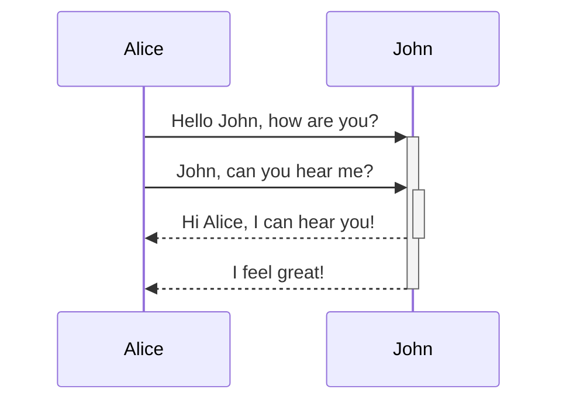
```mermaid
sequenceDiagram
  Alice->>+John: Hello John, how are you?
  Alice->>+John: John, can you hear me?
  John-->>-Alice: Hi Alice, I can hear you!
  John-->>-Alice: I feel great!
```

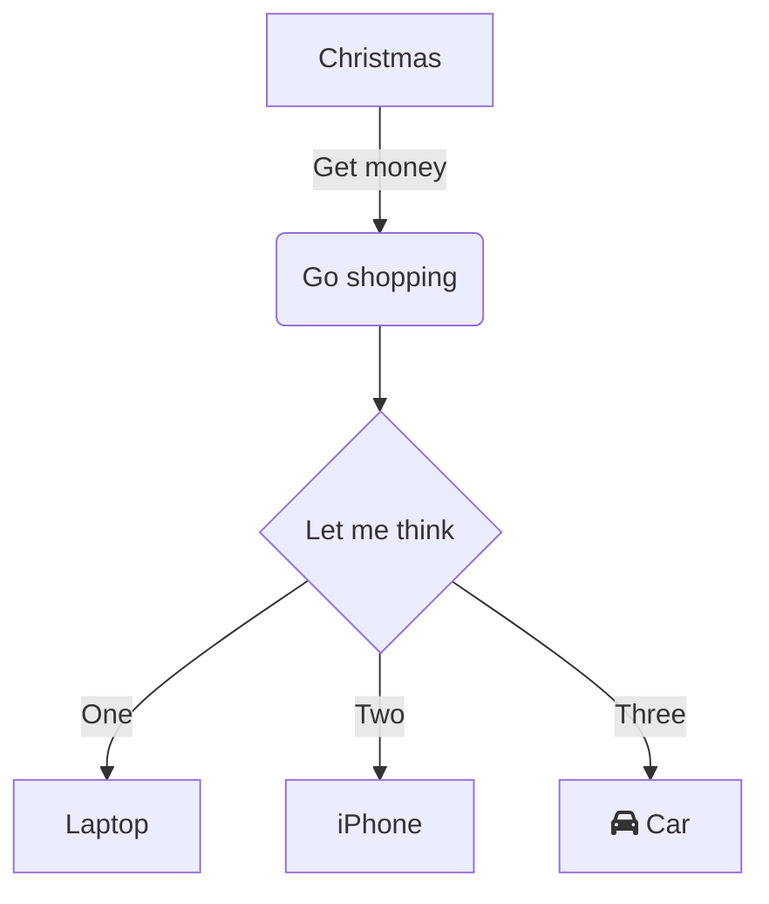
```mermaid
flowchart TD
  A[Christmas] -->|Get money| B(Go shopping)
  B --> C{Let me think}
  C -->|One| D[Laptop]
  C -->|Two| E[iPhone]
  C -->|Three| F[fa:fa-car Car]
```

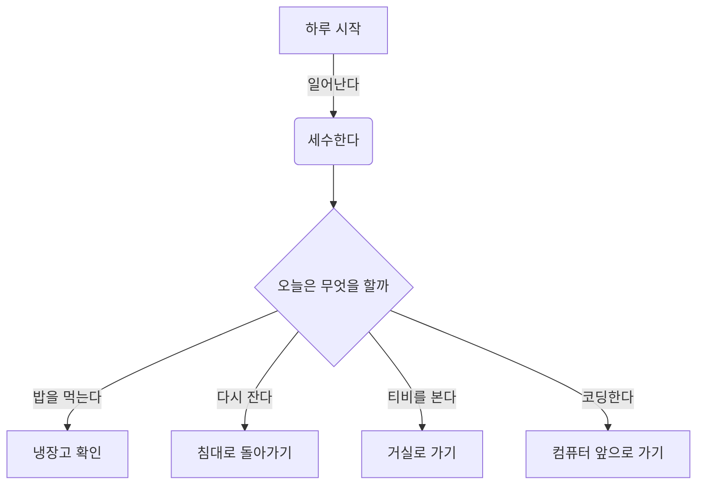
```mermaid
  graph TD
  A[하루 시작] -->|일어난다| B(세수한다)
  B --> C{오늘은 무엇을 할까}
  C -->|밥을 먹는다| D[냉장고 확인]
  C -->|다시 잔다| E[침대로 돌아가기]
  C -->|티비를 본다| F[거실로 가기]
  C -->|코딩한다| G[컴퓨터 앞으로 가기]
```

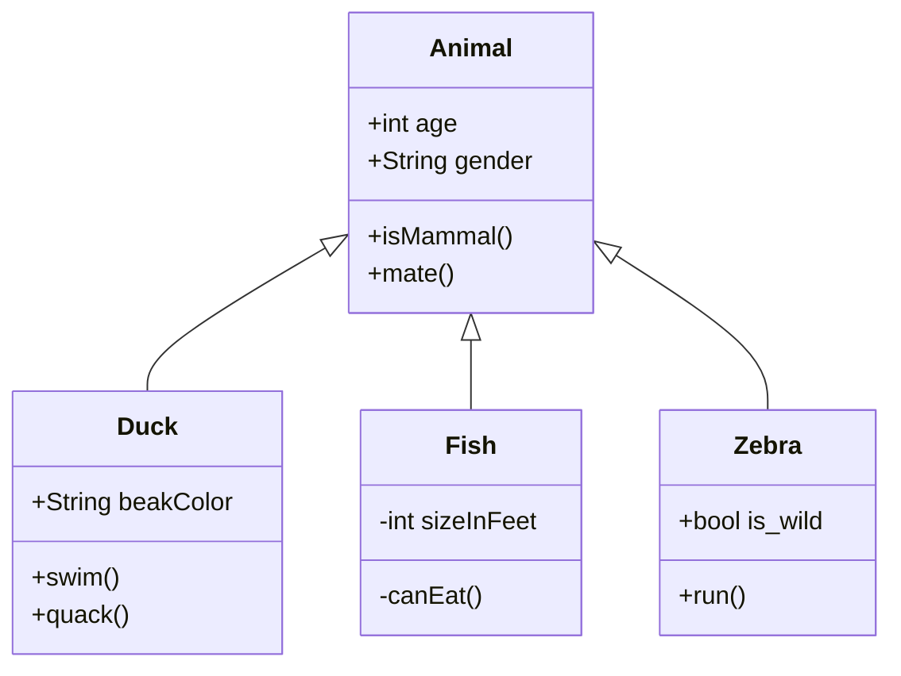
```mermaid
classDiagram
  Animal <|-- Duck
  Animal <|-- Fish
  Animal <|-- Zebra
  Animal : +int age
  Animal : +String gender
  Animal: +isMammal()
  Animal: +mate()
  class Duck{
    +String beakColor
    +swim()
    +quack()
  }
  class Fish{
    -int sizeInFeet
    -canEat()
  }
  class Zebra{
    +bool is_wild
    +run()
  }
```

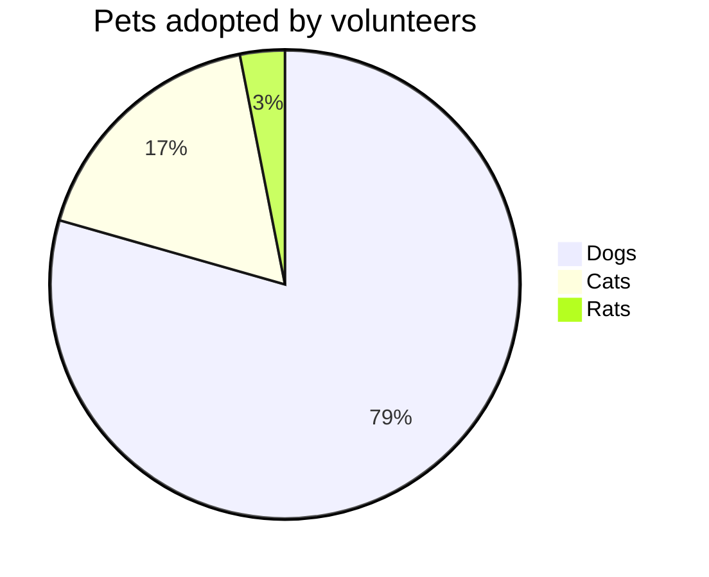
```mermaid
pie
  title Pets adopted by volunteers
  "Dogs" : 386
  "Cats" : 85
  "Rats" : 15
```

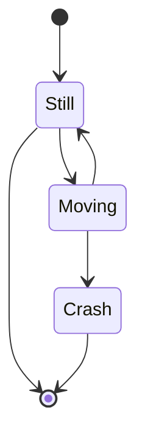
```mermaid
stateDiagram-v2
    [*] --> Still
    Still --> [*]
    Still --> Moving
    Moving --> Still
    Moving --> Crash
    Crash --> [*]
```

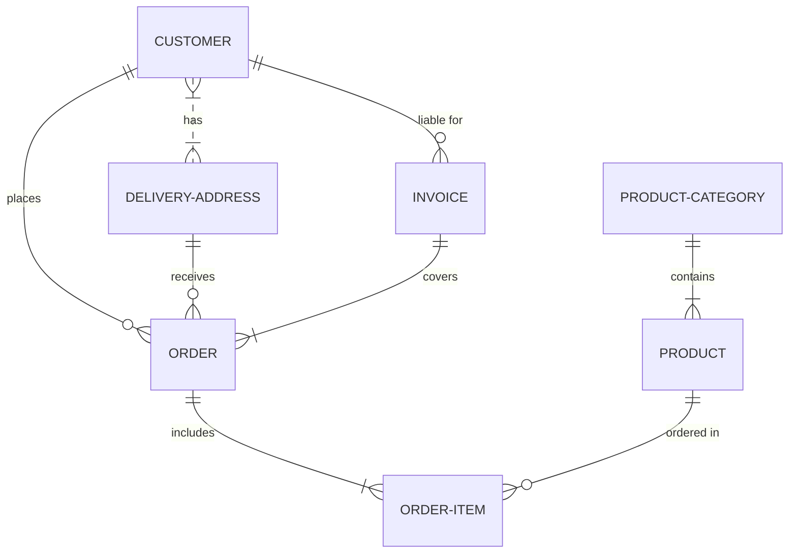
```mermaid
erDiagram
    CUSTOMER }|..|{ DELIVERY-ADDRESS : has
    CUSTOMER ||--o{ ORDER : places
    CUSTOMER ||--o{ INVOICE : "liable for"
    DELIVERY-ADDRESS ||--o{ ORDER : receives
    INVOICE ||--|{ ORDER : covers
    ORDER ||--|{ ORDER-ITEM : includes
    PRODUCT-CATEGORY ||--|{ PRODUCT : contains
    PRODUCT ||--o{ ORDER-ITEM : "ordered in"
```

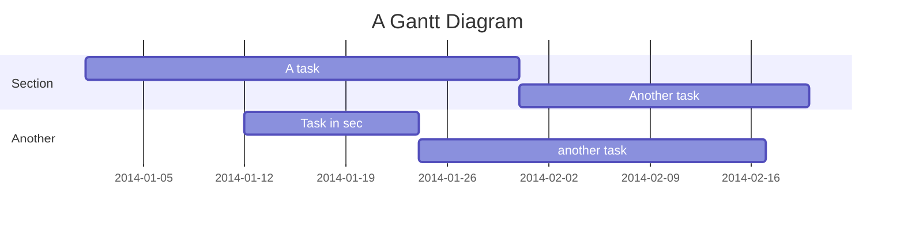
```mermaid
gantt
    title A Gantt Diagram
    dateFormat  YYYY-MM-DD
    section Section
    A task           :a1, 2014-01-01, 30d
    Another task     :after a1  , 20d
    section Another
    Task in sec      :2014-01-12  , 12d
    another task      : 24d
```

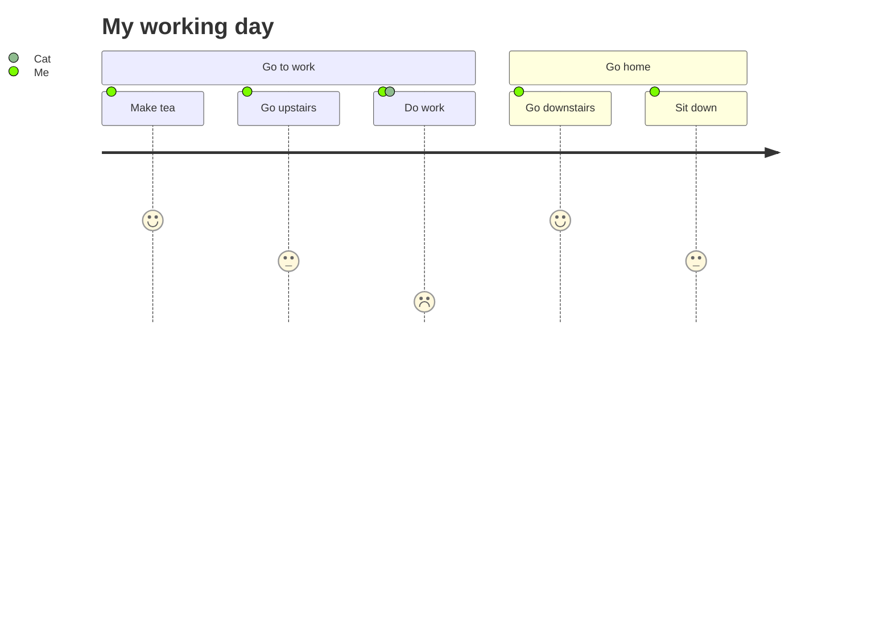
```mermaid
    journey
    title My working day
    section Go to work
      Make tea: 5: Me
      Go upstairs: 3: Me
      Do work: 1: Me, Cat
    section Go home
      Go downstairs: 5: Me
      Sit down: 3: Me
```

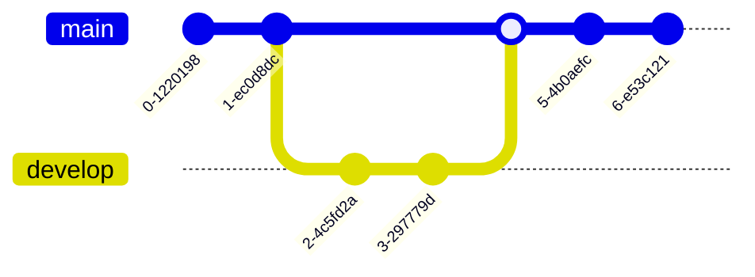
```mermaid
gitGraph
    commit
    commit
    branch develop
    checkout develop
    commit
    commit
    checkout main
    merge develop
    commit
    commit
```

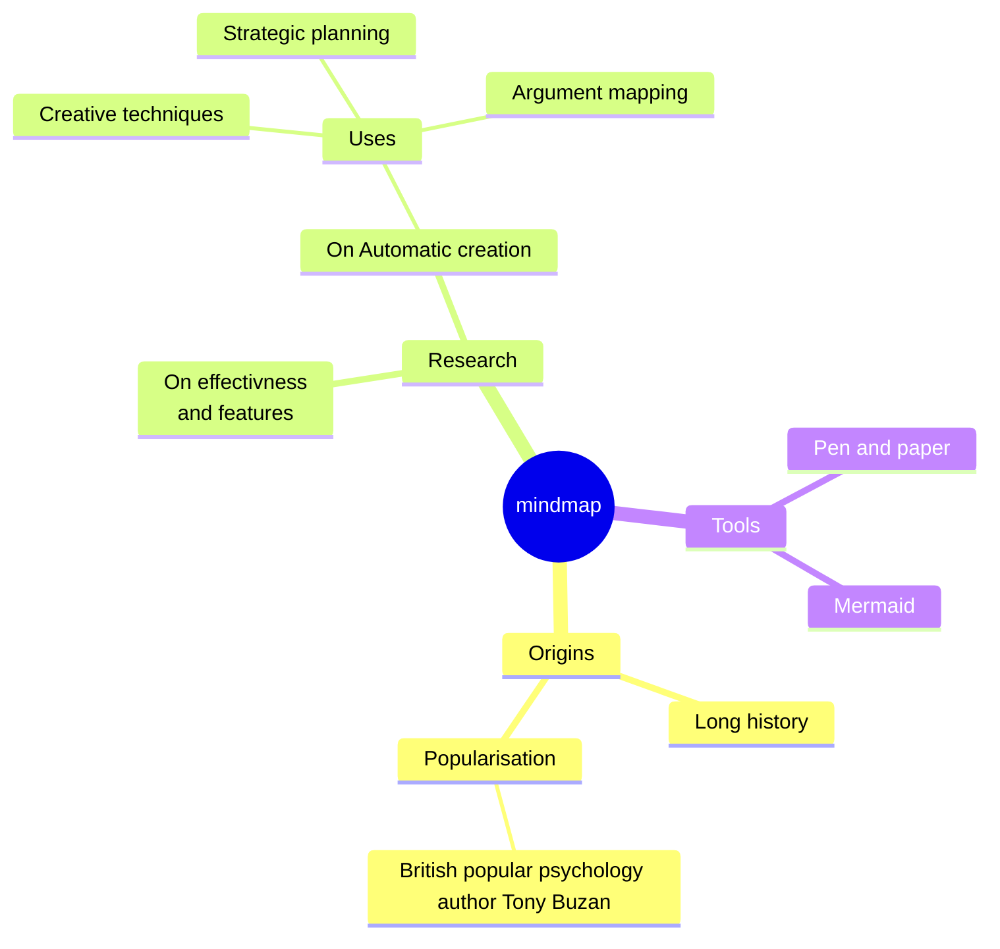
```mermaid
mindmap
  root((mindmap))
    Origins
      Long history
      ::icon(fa fa-book)
      Popularisation
        British popular psychology author Tony Buzan
    Research
      On effectivness<br/>and features
      On Automatic creation
        Uses
            Creative techniques
            Strategic planning
            Argument mapping
    Tools
      Pen and paper
      Mermaid
```
